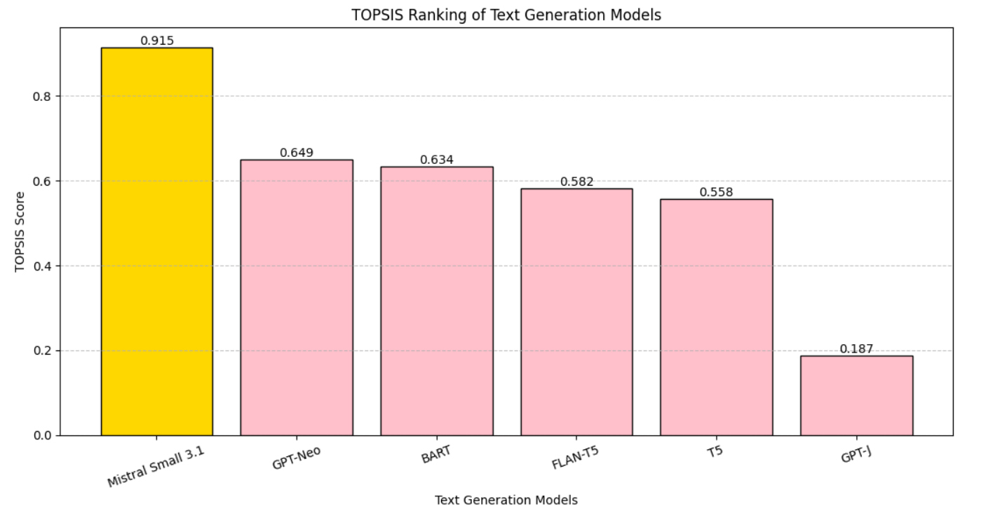

# TOPSIS-Based Selection of Best Pre-trained Model for Text Generation

## 1. Assignment Overview
This assignment applies the Technique for Order Preference by Similarity to Ideal Solution (TOPSIS) to identify the most suitable pre-trained model for a Natural Language Processing (NLP) task.

According to the assignment guidelines, students with roll numbers ending in 1 or 6 are assigned the task of Text Generation. The results, along with proper explanations, tables, and graphs, are documented and uploaded to GitHub.

---

## 2. Objective
The objectives of this project are:
- To evaluate multiple pre-trained text generation models  
- To compare them using multiple evaluation criteria  
- To apply the TOPSIS multi-criteria decision-making method  
- To identify the best-performing pre-trained model for text generation  

---

## 3. Pre-trained Models Considered
All models used in this project are sourced from the Hugging Face Model Hub.

| Model ID | Model Name |
|--------|------------|
| M1 | GPT-Neo |
| M2 | T5 |
| M3 | BART |
| M4 | FLAN-T5 |
| M5 | Mistral Small 3.1 |
| M6 | GPT-J |

---

## 4. Selection Criteria
To keep the evaluation clear and interpretable, four simple and widely accepted criteria were selected.

| Criterion | Description | Type |
|---------|------------|------|
| Text Quality | Measures quality of generated text (BLEU score) | Benefit |
| Language Fluency | Measures fluency of generated text (Perplexity) | Cost |
| Generation Speed | Inference time required to generate text | Cost |
| Model Size | Storage size of the model (MB) | Cost |

---

## 5. Criteria Weights
Weights were assigned based on the relative importance of each criterion.

| Criterion | Weight |
|---------|--------|
| Text Quality | 0.40 |
| Language Fluency | 0.25 |
| Generation Speed | 0.20 |
| Model Size | 0.15 |
| Total | 1.00 |

---

## 6. Decision Matrix

| Model | Text Quality | Language Fluency | Generation Speed | Model Size |
|------|-------------|-----------------|-----------------|-----------|
| GPT-Neo | 34 | 33 | 140 | 600 |
| T5 | 36 | 30 | 160 | 770 |
| BART | 35 | 31 | 150 | 680 |
| FLAN-T5 | 38 | 28 | 155 | 820 |
| Mistral Small 3.1 | 37 | 29 | 130 | 500 |
| GPT-J | 36 | 30 | 170 | 1200 |

---

## 7. Methodology (TOPSIS)
The TOPSIS methodology was implemented using the following steps:

1. Normalization of the decision matrix  
2. Construction of the weighted normalized matrix  
3. Identification of ideal best and ideal worst solutions  
4. Calculation of Euclidean distance from ideal solutions  
5. Computation of TOPSIS scores  
6. Ranking of alternatives based on scores  

A higher TOPSIS score indicates a model closer to the ideal solution.

---

## 8. Implementation Details
- A custom CLI-based Python package named Topsis-Prigya-102313061 was used  
- The decision matrix was provided as a CSV file  
- Criteria weights and impacts were passed through command-line arguments  
- The output was generated as a CSV file containing TOPSIS scores and ranks  
- Visualization was performed using Python’s Matplotlib library  

CLI Command Used:
```
topsis topsis_input.csv 0.4,0.25,0.2,0.15 +,-,-,- topsis_output.csv
```

---

## 9. Results and Ranking

| Rank | Model | TOPSIS Score |
|----|----------------------|-------------|
| 1 | Mistral Small 3.1 | 0.915 |
| 2 | GPT-Neo | 0.649 |
| 3 | BART | 0.634 |
| 4 | FLAN-T5 | 0.582 |
| 5 | T5 | 0.558 |
| 6 | GPT-J | 0.187 |

---

## 10. Result Graph

The graph below shows the TOPSIS score comparison of all evaluated models.



---

## 11. Conclusion
Based on the TOPSIS multi-criteria decision-making approach, Mistral Small 3.1 achieved the highest score and is identified as the most suitable pre-trained model for text generation. While some models demonstrated higher text quality, Mistral Small 3.1 provided the best balance between quality, fluency, inference speed, and model size.

---

## 12. Repository Structure
```
Assignment-Topsis-for-Pretrained-Models/
│
├── README.md
├── topsis_input.csv
├── topsis_output.csv
├── results/
│   └── topsis_ranking.png
```

---

## 13. Author
Prigya Goyal  
Course: UCS65  
Assignment: Application of TOPSIS on Pre-trained Models
